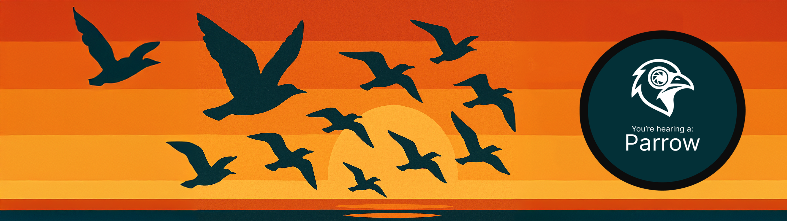

<p align="center">
  <samp>𝗭𝗪𝗜𝗧𝗦𝗖𝗛𝗘𝗥𝗞𝗔𝗦𝗧𝗘𝗡</samp><br><br>
  <br><br>
  <b>A multimodal bird monitoring system combining audio & vision intelligence for edge deployment</b><br><br>
  📄 <i>Find our paper on arXiv <a href="https://arxiv.org/abs/2602.13330">here</a></i> • 
  💾 <i>Pre-trained models on <a href="https://zenodo.org/records/18499119">Zenodo</a></i>
</p>


---

## ✨ Features

🎙️ **Audio Classification** – EfficientNet, MobileNet, PaSST models for species recognition

👁️ **Vision Classification** – YOLO-based image detection and classification

📱 **iOS App** – Native iOS application with on-device inference

🌐 **Web Interface** – Real-time inference dashboard

⚡ **Edge Optimized** – Designed for Raspberry Pi, Rubik Pi, and compatible hardware

---

## 🏗️ Architecture

```
├── Audio_Classification/      AI models for audio-based bird recognition
├── Vision_Classification/     YOLO models for image-based detection
├── Audio_Intent/              Intent recognition for user interactions
├── IOS_App/                   Native iOS application
├── WebApp/                    Web-based inference interface
└── Rubik/                     Edge device integration & streaming
```

## Citation
If you use Zwitscherkasten in your research or project, please cite our paper:
```
@misc{blum2026zwitscherkastendiyaudiovisual,
      title={Zwitscherkasten -- DIY Audiovisual bird monitoring}, 
      author={Dominik Blum and Elias Häring and Fabian Jirges and Martin Schäffer and David Schick and Florian Schulenberg and Torsten Schön},
      year={2026},
      eprint={2602.13330},
      archivePrefix={arXiv},
      primaryClass={cs.CV},
      url={https://arxiv.org/abs/2602.13330}, 
}
```


​